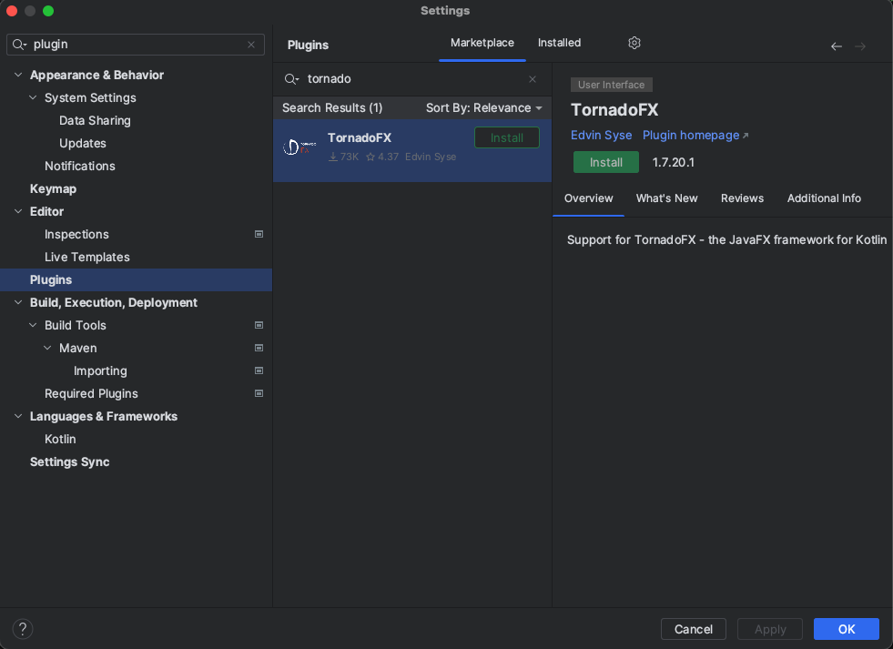
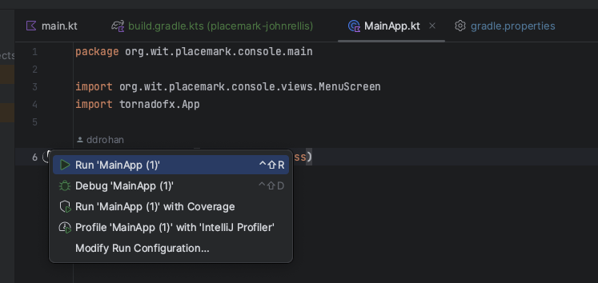
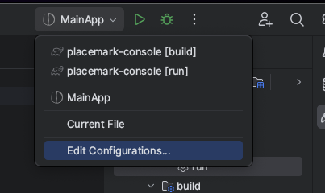
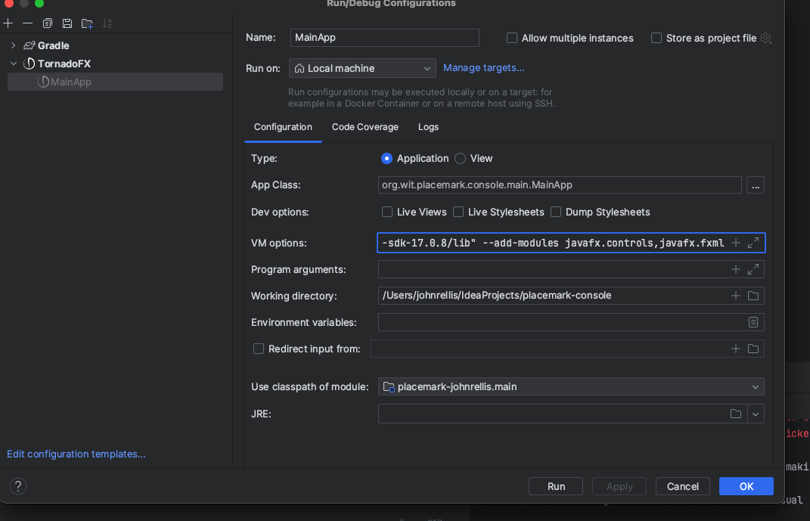

# Tornado FX compatible Place marks

Note, this is tested using openJDK 20 and gradle 8.4.  Gradle wrapper is used in project

Code is not my own, simply configured it to run via gradle and tornadofx.

Should run via gradle application run straight out of the box.

```zsh
./gradlew run
```

To run via intelliJ, ensure the TornadoFX plugin is installed.



Download javafx 17 LTS.

```agsl
https://gluonhq.com/products/javafx/
```

Attempt to run `MainApp.kt`

This will create a run configuration that will likely fail.



To fix this, edit your run configuration



In your run configuration, add to your VM options



```
--module-path "/Users/johnrellis/java/javafx-sdk-17.0.8/lib" --add-modules javafx.controls,javafx.fxml
```

Replacing the path with your javafx-sdk-17